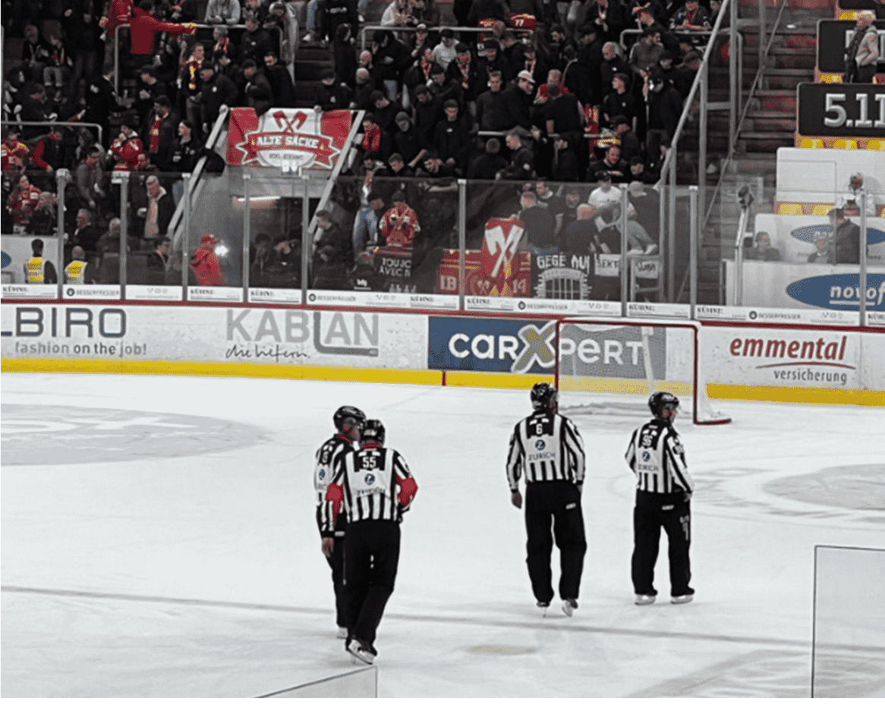
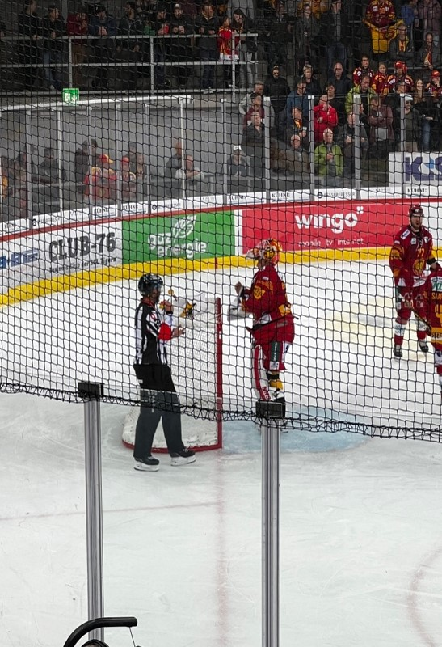
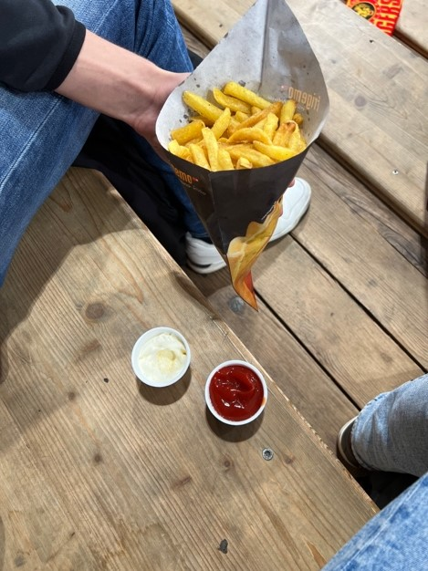
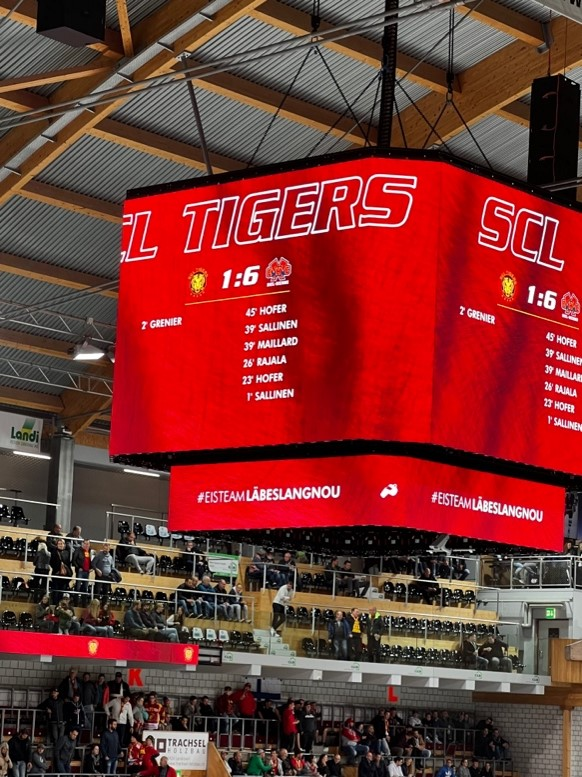

+++
title = "Eishockey- die andere Perspektive"
date = "2022-12-02"
draft = false
pinned = false
tags = ["Eishockey", "Schiedsrichter"]
image = "kommunikation.jpg"
+++


Zuschauen oder mitspielen? So sehen die Schiedsrichter das Spiel auf dem Eis.



Es gibt immer Spieler und Fans, die mit einem Entscheid nicht zufrieden sind. Manche behaupten, es sei ein Foul, andere beklagen sich über den Pfiff. Schuldig dafür sind immer die Schiedsrichter. Doch wie gehen diese damit um? Wir begleiten den National League Head-Schiedsrichter Stefan Hürlimann bei einem Match und erfahren mehr über die Herausforderungen, die diese Position mit sich bringt.

### Die Ruhe vor dem Sturm

Es ist ein ruhiger Freitagabend, die Sonne verkriecht sich hinter den Bergen und in Bern bricht die Abenddämmerung an. Nicht so ruhig ist es in Langnau, wo in Kürze der EHC-Biel gegen die SCL-Tigers in der Ilfis-Arena antritt. Eine halbe Stunde vor dem Match kommen wir beim Stadion an, wo die Leute voller Vorfreude vor den Eingängen stehen. Vor der Türöffnung feuern die Fans ihre Teams bereits fanatisch an. Im Hintergrund läuft Musik und die Essensstände verkaufen bis zur Türöffnung Würste und Pommes. Meterlange Schlangen stehen vor den Ticket- und Foodcorner. Familien sind in voller Montur bereit, mit aller Kraft ihr Team zu unterstützen. Und ohne Bier kann man als Zuschauer ein Eishockeyspiel nicht richtig geniessen.

Im Stadion bereiten sich die Spieler mental auf das Spiel vor und bleiben gleichzeitig in Bewegung, damit sie warm bleiben. Währenddessen führen Schiedsrichter die Background-checks durch. Doch für sie ist dies die letzte Aufgabe vor dem Spiel. Die Schiedsrichter sind schon zwei Stunden vor dem Spiel im Stadion und müssen vieles von der Liste abhaken.

Zu Beginn wird unter den vier Schiedsrichtern der kommende Match vorbesprochen und die gegeneinander antretenden Teams analysiert. «So kennen wir die Geschichte hinter den Teams und können hitzige Situationen mit wütenden und emotionalen Spielern besser verstehen und diese in einem Gespräch entschärfen», sagt Hürlimann. Danach gibt es ein Coaches-Meeting, wo sich die Head-Schiedsrichter mit den Coaches unterhalten – da führen sie meistens ein wenig Smalltalk – und Fragen zum Spiel klären. Vor dem Einlaufen prüfen die Schiedsrichter das Videosystem. Wenn die Kameras oder die Übertragung nicht einwandfrei funktioniere, sei dies sehr unpraktisch und mühsam für die Schiedsrichter, schildert Hürlimann. Die Schiedsrichter können während eines Matchs selbst das Kamerasystem bedienen. Doch funktioniert dieses nicht, wird das Bildmaterial über einen langen Umweg übertragen. Sobald diese Background-Checks beendet sind, ziehen sich die Schiedsrichter um, gleichzeitig können die Türen für die Fans geöffnet werden.

Nun ist es so weit: Die Türen werden geöffnet und wir sind nur noch wenige Minuten vom Anpfiff entfernt. Die Fans werden noch lauter als zuvor, drängen sich zum Eingang und singen die Hymne ihres Teams. Beide Fangruppen betreten das Stadion durch einen anderen Eingang, damit es zu keinen Auseinandersetzungen kommt. Flüche und Beschimpfungen werden trotzdem um sich geworfen.

Im Stadion herrscht eine hitzige Stimmung. Die Fans singen, reden, trinken und schreien euphorisch durch die Menge. Trotz des gekühlten Stadions kommt man bei dieser Energie leicht ins Schwitzen. Auf einmal dämmern die Lichter des Stadions und epische und motivierende Musik beginnt zu spielen. Das Heimteam wird angesagt und die einzelnen Spieler werden vorgestellt. Sie stimmen das Publikum ein. Die Fans kreischen zusammen mit dem Lautsprecher laut die Namen der Spieler, während eine kleine Ecke voller Fans des gegnerischen Teams schweigend dasitzt. Die Spieler betreten das Eisfeld. Die Schiedsrichter prüfen währenddessen zuletzt die beiden Tore und fahren dann zur Mittellinie für den Spielbeginn.

### Anpfiff!

Hürlimann begibt sich in die Mitte des Spielfeldes, macht noch einen letzten Check mit seinen Schiedsrichterpartnern und wirft den Puck. Das erste Drittel beginnt.
Tor! Bereits in der ersten Minute des Spiels schiesst Sallinen Jere flink das erste Tor für den EHC-Biel. Ein fantastischer Start für die Bieler.
Die Spieler können sich nun vor dem nächsten Anspiel entspannen, während der Head-Schiedsrichter den Torschützen und die assistierenden Torschützen melden geht. Die Linesmen fahren mit den Spielern mit und schauen, dass es zu keinen Provokationen oder Auseinandersetzungen kommt.
Es dauert nicht lange, bis Langnau die Bieler mit einem 1:1 in der 2 Minute einholt.
Mit einem Unentschieden endet das erste Drittel.

Die erste 15-minütige Pause beginnt. Zu dieser Zeit kann man sich als Zuschauer entspannen, an der Bar etwas zum Knabbern kaufen und an die frische Luft gehen. Doch als Schiedsrichter hat man solch ein Privileg nicht. Ob die Schiedsrichter auf dem Eis stehen oder in ihrer Garderobe ausruhen, an das Spiel denken sie stets.
Die Schiedsrichter besprechen in der Garderobe meistens, wie sich das Spiel angefühlt hat, ob sie mehr eingreifen müssen oder nicht und ob es Situationen gibt, auf die sie mehr achten müssen.

Kurz bevor die Pause endet, begeben sich die vier Schiedsrichter wieder aufs Eis.
Die Linesmen kontrollieren, ob die Tore richtig angebracht sind und ob die Tornetze noch ganz sind. Zeitgleich kommen die Spieler hinein und kurz darauf beginnt das zweite Drittel.

Im zweiten Drittel dominieren die Bieler die Langnauer. Am eindrucksvollsten war das fünfte Tor von Biel, da es nur neun Sekunden nach dem vierten geschah.
Die Bieler gewinnen das zweite Drittel 4:0 und führen die Partie nun 5:1. Doch noch ist nichts verloren, denn es wird noch ein Drittel gespielt und das Resultat kann sich innerhalb eines Drittels im Handumdrehen ändern.

### Snacks und Erholung

In der zweiten Pause machen wir uns auf den Weg, die Räumlichkeiten der Ilfis-Arena zu besichtigen. Vieles ist abgesperrt, da das Spiel im Gange ist. Zwei Orte können wir trotzdem besuchen.
Einer dieser Orte ist gerade ausserhalb der Arena. Da befinden sich zum grössten Teil Raucher, die ihren Drang nach Tabak nicht zurückhalten können. Also begeben wir uns zum zweiten Ort: der Gastronomiebereich, der mit Fans überfüllt ist. Man kann sich kaum durch die Reihen schlängeln. Doch etwas können sowohl die Fans wie auch wir nicht widerstehen. Die Fritten, knusprig frittiert und dazu perfekt gewürzt.
Es war unwiderstehlich!
Wir gehen zurück auf unsere Plätze und das letzte Drittel startet.

Die Langnauer halten sich gut, jedoch gibt ihnen Biel keine Chance zum Punkten. Schlussendlich bekommt Langnau in der 45 Minute noch das sechste Tor und die Chance auf einen Sieg der Langnauer sinkt immer wie tiefer. Es bräuchte ein Wunder, dass sie in den übrigen 15 Minuten noch fünf weitere Tore schiessen und das Spiel in die Verlängerung zwingen.

Der Jumbotron, ein grosser Bildschirm über dem Eisfeld, zeigt die sechzigste Minute an und somit wird das Spiel mit dem Endresultat 6:1 für den EHC-Biel abgepfiffen.

Die Spieler des Bieler Teams freuen sich über den Sieg. Sie versammeln sich in ihrer Fankurve und umarmen sich, während die Tigers von Enttäuschung kaum ihre Köpfe aufrechthalten können.

Doch wie sieht es in der Schiedsrichtergarderobe aus?
Während die Langnauer-Fans ihre Plätze enttäuscht die Arena verlassen, begeben Ricky und ich uns gespannt zur Schiedsrichtergarderobe, um einen Einblick zu bekommen.

### Nach dem Spiel ist vor dem Spiel

Nach einer intensiven Partie können sich die Schiedsrichter noch nicht entspannen. Vorerst gibt es noch einiges zu besprechen und zu klären. Von jedem National League Spiel werden Aufnahmen gemacht, auf die die Schiedsrichter Zugriff haben. Dieses Videomaterial schauen sie nach Spielende in der Garderobe an, um potenzielle Strafen nachzuschauen und sie auszuwerten. Falls die Schiedsrichter unglücklicherweise eine Strafe übersehen haben, die zu einer Spielsperre führen könnte, müssen sie diese melden. Doch dies geschieht selten, denn wie Hürlimann uns berichtet, pfeift er lieber einmal eine Strafe zu viel als einmal zu wenig.

> *«Ich habe mir mit meinen langen Jahren als Profi-Eishockeyspieler und auch als Schiedsrichter die Gleichgültigkeit antrainiert.»*
>
> *\- Stefan Hürlimann*

Hier und da sind Coaches von Schiedsrichtern an den Spielen anwesend und beobachten die Schiedsrichter während des Spiels. Nach Schlusspfiff erhalten die Schiedsrichter von den Schiedsrichter Coaches in der Kabine ein Feedback, einige allgemeine Anmerkungen zum Spiel. Letzten Endes sind auch Schiedsrichter nicht perfekt.



Stefan Hürlimann wird als ‘Schiedsrichter’ bezeichnet. Doch ist das der passendste Begriff für das Hobby von Hürlimann? Schiedsrichter sei umgänglicher und die meisten verstehen diesen Begriff, weshalb er auch so oft verwendet wird.
Doch der heutige Match sei der beste Beweis, dass sie eher Spielleiter sind als ‘Schiedsrichter’. Kein einziges Mal hat heute ein Spieler auf der Strafbank gesessen. Wie Hürlimann sagt, könne man mit Kommunikation heikle Situation vermeiden und sogar den ganzen Fluss des Spiels beeinflussen



Haben die Schiedsrichter das Spiel besprochen und das Matchblatt überprüft, wird der Match abgeschlossen und danach heisst es für sie: Feierabend. Eine erfrischende Dusche ist essential, etwas Kleines zu essen ebenso und danach heisst es: «Nachhause gehen, das Video nochmal schauen und schlafen gehen, denn morgen ist schon der nächste Match.»

")

### Anforderungen eines Schiedsrichters

Wie soll man nun das Hobby von Stefan Hürlimann am besten beschreiben? Schiedsrichter? Spielleiter? Entscheidungstreffer? Laut Hürlimann ist die beste Beschreibung: «Ein Zuschauer mit dem besten Platz im Stadion». Ihm bereitet es jeweils unglaublich Freude, die Spieler bei ihrer Leidenschaft zu unterstützen und mit ihnen zusammenzuarbeiten. Für Hürlimann gibt es nichts Besseres als schöne Backhandpässe, grossartige Checks und hervorragende Tore zu erleben.



Stefan Hürlimann ist ein Schiedsrichter in der National League Schweiz. Vor seiner Schiedsrichterkarriere war der Schwyzer für 13 Jahre lang ein Profispieler in der National League. Im Dezember 2020 machte der 47-Jährige sein Debut in der National League als Schiedsrichter. Als Ex-Profispieler hatte Stefan Hürlimann grosse Vorteile auf dem Weg zum professionellen Schiedsrichter. Sowohl schlittschuhläuferisch wie auch in Sachen Spielverständnis hatte der langjährige Profi einen Vorsprung. Heute zählt er zu den besten Schiedsrichtern im Schweizer Eishockey.



> *«Ich habe mir mit meinen langen Jahren als Profi-Eishockeyspieler und auch als Schiedsrichter die Gleichgültigkeit antrainiert.»*
>
> *\- Stefan Hürlimann*

Schiedsrichter zu sein, ist nicht immer einfach. Besonders dann, wenn man schwierige Entscheidungen treffen muss. Die Zuschauer, die die Schiedsrichter auspfeifen, und das Reklamieren der Spieler, belasten Hürlimann kaum. Er, als ehemaliger National League Spieler, kann gut mit solchem Druck umgehen. Personen ohne diese Erfahrung können solch einen Druck kaum aushalten.
«Ich habe mir die Gleichgültigkeit mit meinen langen Jahren als Profi-Spieler und Schiedsrichter antrainiert», antwortet Hürlimann zu unserer Frage, wie er mit dem Druck umgehe.
Wenn er eine Strafe auf dem Spielfeld sieht, ist er sich immer zu 100% sicher, dass es eine Strafe ist, bevor er diese ausspricht. Das ist äusserst fundamental, denn die Sicherheit und Präsenz des Schiedsrichters beeinflussen auch seine Glaubwürdigkeit.
Wenn sich ein Schiedsrichter nicht völlig sicher ist, erhält er keinerlei Vertrauen von den Spielern. Und falls eine knappe Straf- oder Torentscheidung vorkommt, würden die Spieler die Meinung des Schiedsrichters nicht akzeptieren, auch wenn diese richtig wäre.
Er sagt uns auch, dass es nichts bringe, in der Vergangenheit zu leben, denn der Entscheid wurde bereits gefällt und das Spiel geht weiter, sei es jetzt richtig oder falsch.
«Bleit man in dieser Situation stecken, macht man nur noch mehr Fehler und man hat noch mehr Getose», so Hürlimann.

Ein Schiedsrichter zu sein ist nicht einfach. Die Anforderungen sind den meisten Leuten nicht bewusst und der Druck und Stress hinter dieser Position wird unterschätzt. Als Ex-Profi hat Stefan Hürlimann einen enormen Vorteil gegenüber anderen Schiedsrichtern, da er beide Perspektiven des Eisfeldes erlebt hat. Doch eins ist klar: wenn die Fans die Schiedsrichter anschreien und verfluchen, verlieren sie ihre Stimme umsonst. Denn für die Schiedsrichter ist das Publikum stumm.

Nun heisst es auch für Ricky und mich Feierabend. Beim Verlassen der Arena, können wir unseren Augen kaum glauben. Wo vor zwei Stunden eine riesige Menschenmenge stand und wo wir uns kaum durchschlängeln konnten, sind nur noch ein paar Menschen zu sehen.
Nun heisst es für uns: Nachhause gehen, über unsere Notizen schauen und schlafen gehen. Jedoch haben wir im Gegensatz zu Hürlimann keinen weiteren Match am nächsten Tag, sondern den ersten Ferientag.